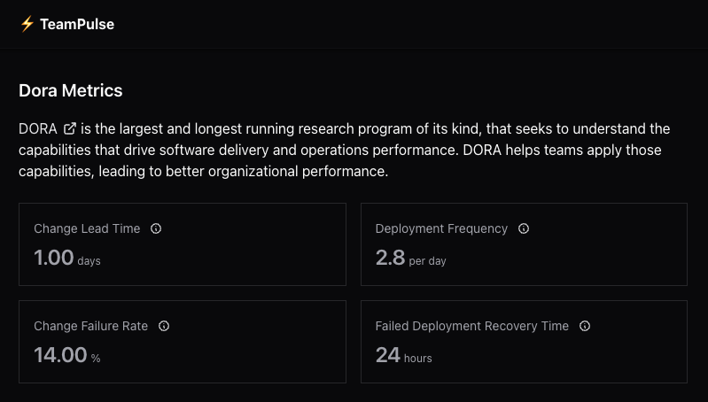

# TeamPulse Frontend

Welcome to the frontend part of TeamPulse.

It's pretty bare-bones right now, but we're just getting started!

## Features

A super simple dashboard that shows your team's DORA metrics. That's it! (for now 😉)

- 📊 Single-page dashboard
- 📈 DORA metrics visualization
- 🎨 Dead simple UI (like, really simple)

## Getting Started

1. Clone this repository
2. Run `npm install`
3. Fire it up with `npm run dev`
4. Visit `http://localhost:5173` (or whatever Vite suggests)

## Tech Stack

- React
- Vite
- TypeScript
- Chakra UI

## What's Next?

This is just the beginning! More cool stuff coming soon...
